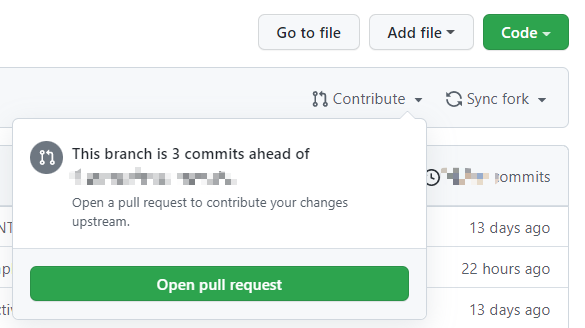

# Contribute To This Repo

如果你想在此网站上发布文章的话，请往下看:)

## 必要的环境

* github

GitHub是~~全球最大的同性交友平台~~ 一个面向开源及私有软件项目的托管平台

你必须有一个[github账号](https://github.com/)，才能向这个仓库提交内容，这里有一份[教程](https://cloud.tencent.com/developer/article/1487508)

* git

为了和Github进行交互，团队选择Git作为版本管理工具，你需要进行[Git的基础配置](https://www.cnblogs.com/techflow/p/13703721.html)，更多Git用法这里不再赘述。

## 正文开始

此网站通过Gitbook渲染markdown得到html文件，并配合Github Action实现CI部署。简单来说，此网站是和[这个仓库](https://github.com/nArrow4/LangYa-Tutorials)关联的，仓库中的内容会显示到网站上。

感兴趣的同学也可以通过这一形式搭建自己的网站。

接下来介绍如何向关联仓库中提交。

> Github中有[一个项目](https://github.com/firstcontributions/first-contributions)专门为初学者准备，任何人都可以提交PR，感兴趣的同学自行测试。

### Fork本仓库

在[这个页面](https://github.com/nArrow4/LangYa-Tutorials)点击Fork按钮，就可以发现你自己的主页中多了一个新的仓库，名字是https://github.com/${YOUR_NAME}/LangYa-Tutorials


### 将你的修改加入工程

先将仓库拷贝到本地
```sh
git clone https://github.com/${YOUR_NAME}/LangYa-Tutorials
```
在git bash（如果你使用的是linux打开一个shell）中输入上述指令，即可将仓库拷贝到本地。然后就可以随意修改辣！

如果你是在原有文件的基础上修改，直接修改即可；如果需要创建新文件，请在Summary中添加目录，并将文件放在指定的位置。如果引用了图片文件，放到对应chapter的assets文件夹中。

### 提交到你自己的仓库

输入如下指令，再去Github上查看你的仓库就可以看到最新的修改。Push的时候可能需要输入Username和Token，如果你懒得每次都输一边，网上有很多方法，请自行搜索。

```sh
git add .
git commit -m "your commit messages"
git push origin main
```

注意commit消息需要满足以下格式：

```
[file path]: your changes(Zh/En)
```

比如

```
[chapter0/how_to_contribute.md]: Add pull request guidance
```

### 创建Pull Request

按照下图的方式提交修改，然后等待审核即可。如果提交前提示有冲突，请拉取最新的工程，然后重新提交。

