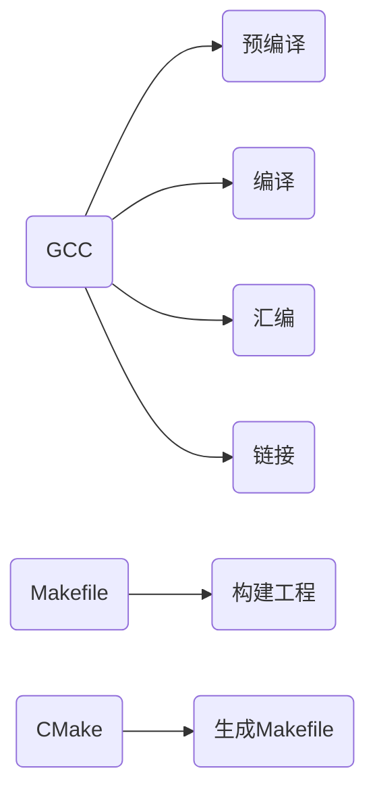

# Section1.2: GCC && Makefile && CMake

## C/C++代码是怎么在系统上运行的



## GCC编译代码

### gcc编译选项

1. -c ：指编译，不链接，生成目标文件“.o”。
2. -S ：只编译，不汇编，生成汇编代码“.S”。
3. -E ：只进行预编译/预处理，不做其他处理。
4. -o file：把输出文件输出到file里。
5. -Wall ：允许发出gcc提供的所有有用的报警信息
6. -Werror ：把所有的告警信息转化为错误信息，并在告警发生时终止编译过程
7. -I dir ：在头文件的搜索路径列表中添加dir目录
8. -L dir ：在库文件的搜索路径列表中添加dir目录
9. -On ：来控制优化代码的等级

其实这些选项说明都可以使用$gcc --help$查询，还是希望大家习惯这种方式

### hello world example

用一个简单的C++程序来举例

```cpp
// hello.cpp
#include "hello.h"

int print() {
    std::cout << "hello world." << std::endl;
}

// hello.h
#include <iostream>
void print();

// hello.cpp
#include "hello.h"

int main() {
    // print hello world
    print();
}
```

### 预编译

这一部分主要做两件事情：
1. 把所有的头文件和宏定义展开
2. 把代码中的所有注释去掉

```sh
g++ --E main.cpp -o main.i
```

查看main.i文件的末尾

```cpp
...

# 3 "hello.h"
void print();
# 2 "main.cpp" 2

int main() {

 print();
}

```

### 编译

将预编译代码编译成汇编代码
```sh
g++ -S main.i -o main.s
```

```cpp
main:
    ...
```

### 汇编

编译汇编代码得到重定向代码
```sh
g++ -c main.s -o main.o
```

### 链接

链接所有重定向代码和库文件得到可执行文件
```sh
g++ main -o main.o
```

## Makefile构建工程

make命令执行时，需要一个makefile文件，以告诉make命令需要怎么样的去编译和链接程序。

首先，用一个示例来说明makefile的书写规则，以便给大家一个感性认识。工程有两个c文件，和一个头文件，我们要写一个makefile来告诉make命令如何编译和链接这几个文件。我们的规则是：

1. 如果这个工程没有编译过，那么我们的所有c文件都要编译并被链接。
2. 如果这个工程的某几个c文件被修改，那么我们只编译被修改的c文件，并链接目标程序。
3. 如果这个工程的头文件被改变了，那么我们需要编译引用了这几个头文件的c文件，并链接目标程序。

### Makefile的规则

Makefile的规则是：当依赖项中如果有一个及以上的文件比目标文件要新的话，就会重新执行指令构建目标文件。

```makefile
目标文件: 依赖项
    生成目标文件的指令
```

### Makefile hello world

```makefile
# src file
SOURCES := hello.cpp main.cpp
OBJ := hello.o main.o
TARGET := main

# compiler
CC := g++
INCLUDE := -I .

$(TARGET): $(OBJ)
	$(CC) $(OBJ) -o $(TARGET)

hello.o: hello.cpp hello.h
	$(CC) -c hello.cpp -o hello.o

main.o: main.cpp hello.h
	$(CC) -c main.cpp -o main.o

.PHONY: all
all: $(TARGET)

.PHONY : clean
clean:
	rm $(OBJ) $(TARGET)

.PHNOY : install
install:
    ...
```

## CMake简化Makefile

### cmake安装及使用

* install

```sh
sudo apt-get install cmake 
# 更推荐使用下面的指令
sudo apt-get install build-essential
```

* build

```sh
# cd to your proj.
mkdir build && cd build
cmake ..
make
./${EXECUTABLE_FILE}
```

### hello world sample

```cmake
# CMakeLists.txt
cmake_minimum_required(VERSION 3.16.3)
project(hello)

include_directories(.)
add_executable(main 
    hello.cpp
    main.cpp)
```

### 链接开源库

* 链接OpenCV

```cmake
# CMakeLists.txt
cmake_minimum_required(VERSION 3.16.3)
project(opencv_demo)

find_package(OpenCV REQUIRED)

include_directories(.)
include_directories(${OpenCV_INCLUDE_DIRS})

add_executable(main 
    main.cpp)

target_link_libraries(main
    ${OpenCV_LIBRARIES})
```

* 链接自己的库

首先我们将print函数编译成库文件

```sh
ar -crv hello.a hello.o
```

此时，库文件hello.a中就包含print函数的实现，当需要使用hello.a时，只需

```sh
g++ main.o hello.a -o main
```

### 更优雅地构建工程

### functions

```cmake
functions(function_name args1 args2 ...)
    message(${args1} ${args2} ...)
endfunctions(function_name)
```