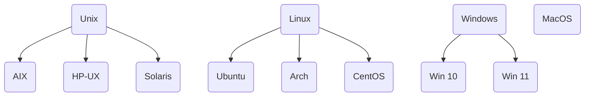

# Section1.1: Linux

## 常见的操作系统

> [推荐阅读1: 操作系统Unix、Windows、Mac OS、Linux的故事 科普篇](https://blog.csdn.net/zhanghow/article/details/53542397)

### 为什么选择Ubuntu

1. 运行稳定
2. 开源社区丰富，Debian维护的软件库兼容性很高，使用开源库非常方便
3. 新手友好

## Linux常用指令

## 为什么不详细讲Linux的使用？

你可能会想: 这是我第一次接触GNU/Linux, 为什么上课不讲讲怎么用?

因为说明书不是用来讲的, 是用来一边看一边操作的; 你对这些工具也不是靠听来掌握的, 而是自己动手去尝试. 你在大学课堂上应该接受到的是那些一脉相承的知识, 然后去思考这些知识背后的原则和思想, 将来有能力将这些原则和思想应用到新的领域.

我们设计这些实验内容, 是为了让你明白, 你有能力自己去看教程学习新的工具; 以及, 以后接触新事物的时候, 你不应该等着别人来给你讲, 而应该自己主动去找教程来学习如何使用.