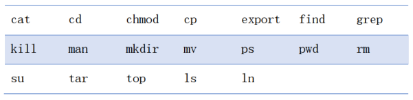

# Section1.1: Linux

## 常见的操作系统

> [推荐阅读1: 操作系统Unix、Windows、Mac OS、Linux的故事 科普篇](https://blog.csdn.net/zhanghow/article/details/53542397)

### 为什么选择Ubuntu

1. 运行稳定
2. 开源社区丰富，Debian维护的软件库兼容性很高，使用开源库非常方便
3. 新手友好

## Linux常用指令

## Linux 文件系统

### Linux一级目录

|项目|Value|
|-|-|
|/bin|存放系统命令，普通用户和root用户都可以执行。放在/bin下的命令在单用户模式下也可以执行|
|/dev|设备文件保存位置|
|/etc|配置文件保存位置。系统内所有采用默认安装方式(rpm安装)的服务配置文件全部保存在此目录中，如用户信息、服务的启动脚本、常用的服务配置文件等|
|/home|普通用户的主目录，也称为家目录。在创建用户时，每个用户要有一个默认登陆和保存自己数据的位置，就是用户的主目录，所有普通用户的主目录是在/home/下建立一个和用户名相同的目录|
|/lib|系统调用的函数库保存位置|
|/mnt|挂载目录。早期Linux只有这一个挂载目录，并没有细分。系统建议这个目录用来挂载额外的设备，如U盘、系统硬盘和其他操作系统的分区|
|/|root的主目录。普通用户主目录在/home/下，root主目录直接挂载在"/"下|

### Linux /usr目录

|项目|Value|
|-|-|
|/usr/bin|存放系统命令，普通用户和超级用户都可以执行。这些命令和系统启动无关，在单用户模式下不能执行|
|/usr/lib|应用程序调用的函数库保存位置|
|/usr/local|手工安装的软件保存位置。我们一般建议源码包软件安装在这个位置|
|/usr/include|C/C++ 等编程语言头文件的放置目录|

### 其他常用

|项目|Value|
|-|-|
|.|当前目录|
|..|上级目录|
|~|home目录|

## 为什么不详细讲Linux的使用？

你可能会想: 这是我第一次接触GNU/Linux, 为什么上课不讲讲怎么用?

因为说明书不是用来讲的, 是用来一边看一边操作的; 你对这些工具也不是靠听来掌握的, 而是自己动手去尝试. 你在大学课堂上应该接受到的是那些一脉相承的知识, 然后去思考这些知识背后的原则和思想, 将来有能力将这些原则和思想应用到新的领域.

我们设计这些实验内容, 是为了让你明白, 你有能力自己去看教程学习新的工具; 以及, 以后接触新事物的时候, 你不应该等着别人来给你讲, 而应该自己主动去找教程来学习如何使用.