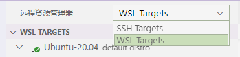
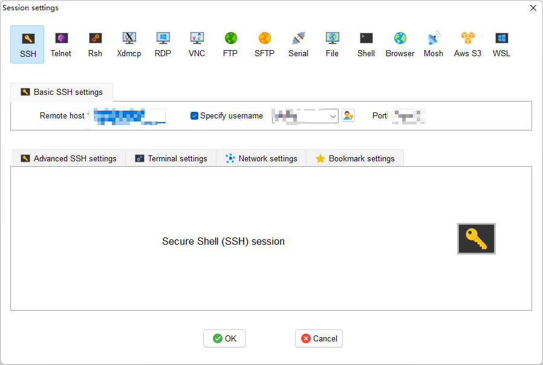

# Section1.5: SSH

## SSH command

Linux 一般作为服务器使用，而服务器一般放在机房，你不可能在机房操作你的 Linux 服务器。

这时我们就需要远程登录到Linux服务器来管理维护系统。

Linux 系统中是通过 ssh 服务实现的远程登录功能，默认 ssh 服务端口号为 22。

使用ssh连接远程服务器
```sh
ssh [OPTIONS] [-p PORT] [USER@]HOSTNAME [COMMAND]
# 例如
ssh nvidia@192.168.137.15 -p 22
```

## VSCode Remote (SSH & WSL)



## MobaXterm



## CLion

具体参考资料《你奶奶都能学会的CLion汉化与远程部署教程》